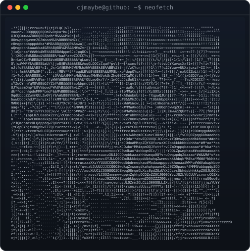

<table>
<tr>
<td valign="top"></td>
<td valign="top"></td>
</tr>
</table>

### Skills

#### *Languages & Frameworks:*

    

#### *Tools & Infrastructure:*

    

### Socials & Links

 

  &nbsp;&nbsp;
  &nbsp;&nbsp;
  &nbsp;&nbsp;
  &nbsp;&nbsp;
  

### Github Stats

 

    
  
   
  
  

### Contributions

 

<picture>
  <source media="(prefers-color-scheme: dark)" srcset="https://raw.githubusercontent.com/cjmaybe/cjmaybe/output/pacman-contribution-graph-dark.svg">
  <source media="(prefers-color-scheme: light)" srcset="https://raw.githubusercontent.com/cjmaybe/cjmaybe/output/pacman-contribution-graph.svg">
  
</picture>

 

  

